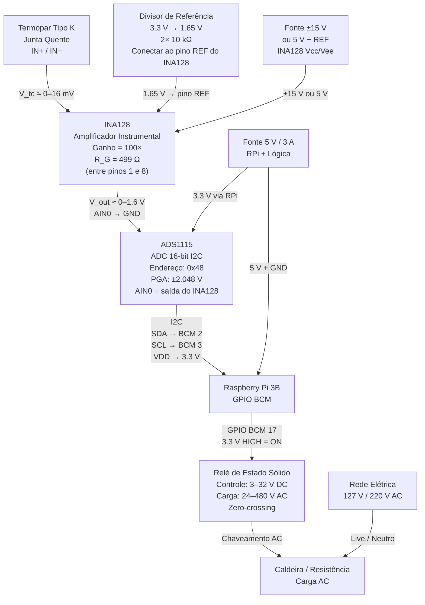

# Esquemático Eletrônico — Controlador de Temperatura

## Diagrama de Blocos



## Conexões do Raspberry Pi 3B

| Sinal | Pino GPIO (BCM) | Pino Físico | Destino |
|---|---|---|---|
| I2C SDA | BCM 2 | Pino 3 | ADS1115 SDA |
| I2C SCL | BCM 3 | Pino 5 | ADS1115 SCL |
| SSR Control | BCM 17 | Pino 11 | SSR IN+ |
| 3.3 V | — | Pino 1 ou 17 | ADS1115 VDD, pull-ups I2C |
| GND | — | Pino 6, 9, 14... | GND comum |

> **Atenção:** Use numeração **BCM** no software (já configurado). Não confunda com o número físico do conector.

## Conexões ADS1115

| Pino ADS1115 | Destino |
|---|---|
| VDD | 3.3 V (do RPi) |
| GND | GND |
| SCL | BCM 3 (pino físico 5) |
| SDA | BCM 2 (pino físico 3) |
| ADDR | GND → endereço 0x48 |
| AIN0 | Saída do INA128 (Vout) |
| AIN1 | GND (não usado — leitura single-ended) |

> **Resolução:** PGA ±2.048 V → LSB = 62.5 µV. Para 400 °C com ganho 100:  
> V_INA = 100 × 41.276 µV/°C × 400°C ≈ 1.65 V → dentro da faixa.

## Conexões INA128

| Pino INA128 | Destino |
|---|---|
| IN+ (pino 3) | Fio positivo do termopar (+) |
| IN− (pino 2) | Fio negativo do termopar (−) |
| REF (pino 5) | 1.65 V (divisor de 3.3 V com 2× 10 kΩ) |
| RG (pinos 1 e 8) | Resistor 499 Ω entre eles → Ganho = 100× |
| V+ (pino 7) | +15 V (ou +5 V com op-amp rail-to-rail) |
| V− (pino 4) | −15 V (ou GND com fonte single-supply) |
| OUT (pino 6) | ADS1115 AIN0 |

### Por que o pino REF precisa de 1.65 V?

O termopar Tipo K gera tensão proporcional a `T_hot − T_cold_junction`. Quando
`T_hot ≈ T_cold_junction` (sistema frio), a tensão diferencial é quase zero.  
Sem a referência em mid-supply, o INA128 com alimentação single-supply (+5 V / GND)
não consegue representar saídas próximas de zero (o op-amp interno satura).  
Biasando o pino REF em **V+/2 = 1.65 V**, o ponto de zero fica no meio da faixa
de saída, garantindo operação correta mesmo para temperatura ambiente.

## Conexões SSR

| Terminal SSR | Destino |
|---|---|
| DC+ (controle) | GPIO BCM 17 via resistor 330 Ω |
| DC− (controle) | GND |
| AC1 (carga) | Fase da rede (Live) |
| AC2 (carga) | Um terminal da resistência da caldeira |
| Outro terminal da resistência | Neutro da rede |

> **Segurança:** A parte de carga AC (230 V) deve ser isolada da lógica 3.3 V.
> O SSR já fornece isolação óptica interna. Nunca toque nos terminais AC com o
> sistema energizado.

## Cálculo do Ganho do INA128

```
Ganho = 1 + 50 kΩ / R_G
R_G = 50 kΩ / (Ganho − 1)
R_G = 50 000 / (100 − 1) ≈ 505 Ω  →  use 499 Ω (valor E96 padrão)
```

Ganho real com 499 Ω: `1 + 50 000 / 499 ≈ 101.2×` (erro < 2%, aceitável).

## Diagrama de Timing do SSR (Time-Proportioning)

```
PID output = 0.6  →  on_time = 1.2 s, off_time = 0.8 s (ciclo de 2 s)

  ____        ____        ____
 |    |      |    |      |    |
─┘    └──────┘    └──────┘    └──
 1.2s  0.8s  1.2s  0.8s  1.2s
```

O ciclo de 2 s é adequado para SSRs de zero-crossing e resistências de aquecimento.
Evita desgaste mecânico (SSR é eletrônico) e mantém boa resolução de controle.
