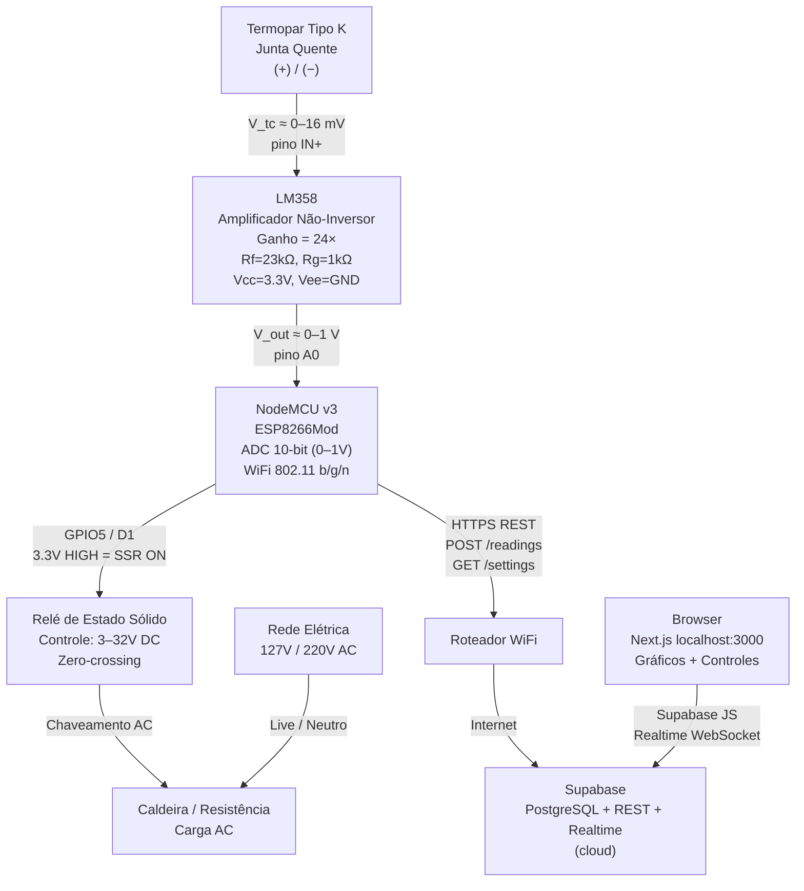

# Esquemático V2 — NodeMCU ESP8266 + LM358 + SSR

> Revisão: RPi removido. NodeMCU faz leitura do termopar, PID e controle do SSR.
> Dados enviados via WiFi → Supabase (cloud) → Dashboard Next.js (browser).

## Diagrama de Blocos



## Conexões do NodeMCU v3

| Sinal | Pino NodeMCU | GPIO | Destino |
|---|---|---|---|
| ADC (termopar) | A0 | ADC0 | Saída do LM358 |
| SSR Control | D1 | GPIO5 | SSR IN+ (via resistor 330Ω) |
| 3.3V | 3V3 | — | LM358 Vcc, resistores pull |
| GND | GND | — | GND comum, LM358 Vee, SSR IN− |

> **Atenção:** O pino A0 do NodeMCU v3 aceita no máximo **1.0V**. A saída do LM358 não deve ultrapassar esse valor.

## Circuito do LM358 (amplificador não-inversor)

```
3.3V ──┬──────────────────────────── Vcc (pino 8 do LM358)
       │
       R_f = 23 kΩ
       │
OUT ───┼─────────────────────────── A0 do NodeMCU (máx 1.0V)
       │
       R_g = 1 kΩ
       │
GND ───┴──────────────────────────── Vee (pino 4 do LM358)
                                     Termopar (−)

Termopar (+) ──────────────────────── IN+ (pino 3 do LM358)
```

**Amplificador não-inversor:**
```
Vout = Vin × (1 + Rf/Rg) = Vin × 24
```

**Faixa de saída:**
```
T=0°C   → Vout = 0 × 41.276µV × 24 ≈ 0 V
T=400°C → Vout = 400 × 41.276µV × 24 ≈ 0.396 V   (com cold junction 25°C)
```

> **Nota:** Para temperatura ambiente de 25°C, o offset do cold junction é compensado por software via parâmetro `cj_offset` no Supabase.

## Cálculo de temperatura no firmware

```
V_adc = analogRead(A0) / 1023.0   // 0.0 – 1.0 V
V_tc  = V_adc / 24                // retira ganho do LM358 → tensão do termopar
T     = V_tc / 41.276e-6 + (25.0 + cj_offset)
```

Pipeline de filtragem:
```
ADC raw → média móvel (janela 5) → filtro de Kalman (Q=0.05, R=5.0) → °C
```

## Conexões do SSR

| Terminal SSR | Destino |
|---|---|
| DC+ (controle) | GPIO5/D1 via resistor 330Ω |
| DC− (controle) | GND |
| AC1 (carga) | Fase da rede (Live) |
| AC2 (carga) | Terminal da resistência da caldeira |
| Outro terminal | Neutro da rede |

## Fluxo de dados

```
NodeMCU (10 Hz leitura, 15s envio)
    ↓ HTTPS POST /rest/v1/readings
Supabase PostgreSQL
    ↓ Realtime WebSocket (INSERT event)
Next.js browser (atualização imediata do gráfico)

Browser → atualiza settings (setpoint, PID, start/stop)
    ↓ HTTPS PATCH /rest/v1/settings
Supabase PostgreSQL
    ↓ NodeMCU polling GET /rest/v1/settings (30s)
PID + SSR atualizados
```

## Diagrama de timing do SSR

```
PID output = 0.6  →  on=1.2s, off=0.8s (ciclo 2s)

  ┌─────┐     ┌─────┐     ┌─────┐
  │     │     │     │     │     │
──┘     └─────┘     └─────┘     └──
  1.2s   0.8s  1.2s  0.8s  1.2s
```

Implementação sem timers (single-threaded):
```cpp
bool ssr = (millis() % 2000) < (fraction * 2000);
```
